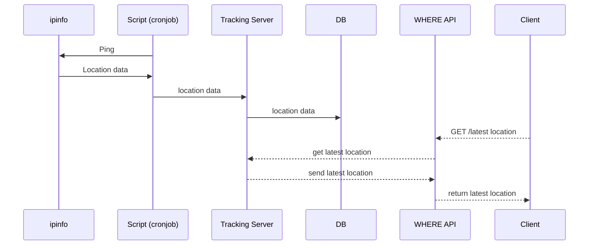

# WHERE Ping API
This code is for the "Tracking Server" part of the sequence below

```mermaid
sequenceDiagram
    participant Ipinfo as ipinfo
    participant Script as Script (cronjob)
    participant TrackingServer as Tracking Server
    participant DB as DB
    participant WhereAPI as WHERE API
    participant Client


    Script ->> Ipinfo: Ping
    Ipinfo ->> Script: Location data
    Script ->> TrackingServer: location data
    TrackingServer ->> DB: location data

    
    Client -->> WhereAPI: GET /latest location
    WhereAPI -->> TrackingServer: get latest location
    TrackingServer -->> WhereAPI: send latest location
    WhereAPI -->> Client: return latest location

```
